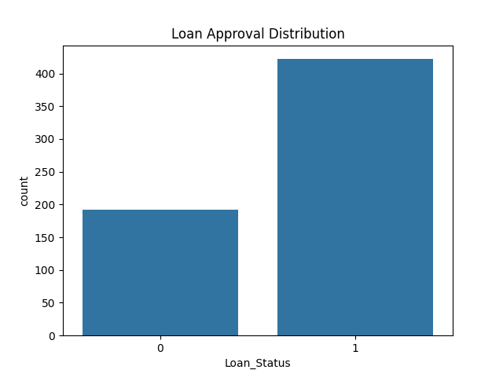
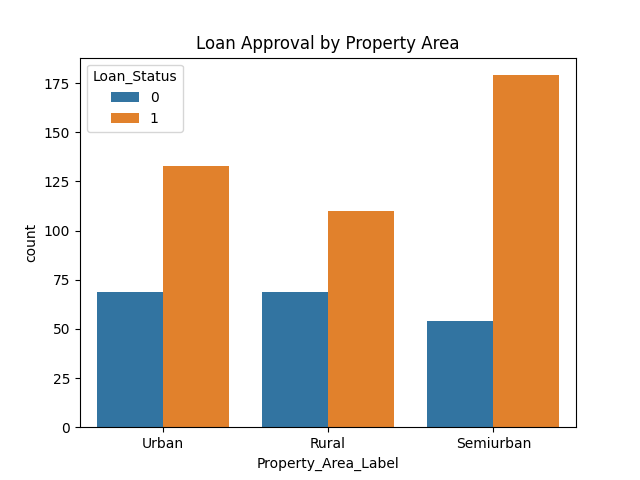
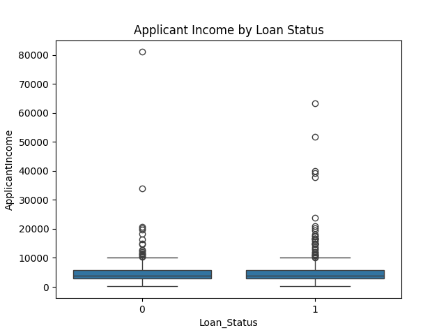
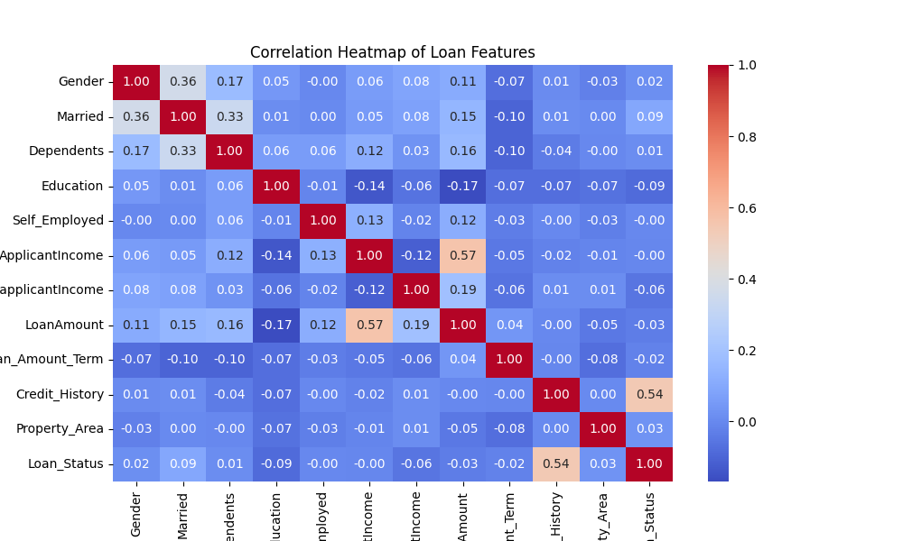
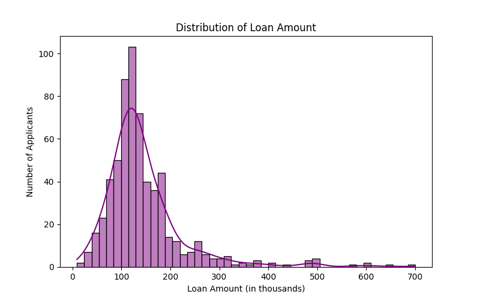

# 📊 Loan Prediction ML Project

This project predicts whether a loan application will be approved or not using a Logistic Regression model. The dataset contains applicant details such as income, education, credit history, and property area.

---

## 📁 Dataset

The dataset used for this project is from a loan prediction problem and includes information like:

- Gender  
- Married  
- Dependents  
- Education  
- Self_Employed  
- ApplicantIncome  
- CoapplicantIncome  
- LoanAmount  
- Loan_Amount_Term  
- Credit_History  
- Property_Area  
- Loan_Status

---

## 🛠️ Libraries Used

- `pandas`
- `numpy`
- `scikit-learn`
- `matplotlib`
- `seaborn`

---

## 📌 Project Workflow

1. **Data Cleaning**
   - Handled missing values using mode and median.
   - Encoded categorical variables using LabelEncoder.
   - Converted '3+' dependents to numeric.

2. **Exploratory Data Analysis (EDA)**
   - Countplots for loan status distribution.
   - Countplots for loan approval by property area.
   - Boxplot for applicant income by loan status.
   - Correlation heatmap of numerical features.
   - Distribution plot of loan amounts.

3. **Model Building**
   - Split the data into training and testing sets.
   - Trained a Logistic Regression model.
   - Evaluated using accuracy score and classification report.
   - Made predictions for a new applicant.

---

## 📊 Visualizations

---

## 📈 Results

Achieved a good prediction accuracy for loan approval based on applicant details.

--
